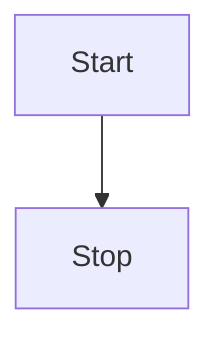

# Welcome to Minos Protocol Standard

En este documento queremos definir los estandares para la integracion y el desarollo
de redes distribuidas de microservicios. Distribution of this memo is unlimited

## Abstract

El protocolo para microservicios Minos define:

* Estructura de los Eventos
* Estructura de los Comandos
* Proceso de almacenamiento de los eventos
* Proceso de creacion de los Snapshots
* Transacionalidad de los Eventos en entrada
* Transacionalidad de los Eventos en salida
* Transacionalidad de los Comandos en entrada
* Transacionalidad de los Comandos en salida
* Consistencia del dato en una SAGA ( coreography )

## Table of Contents

